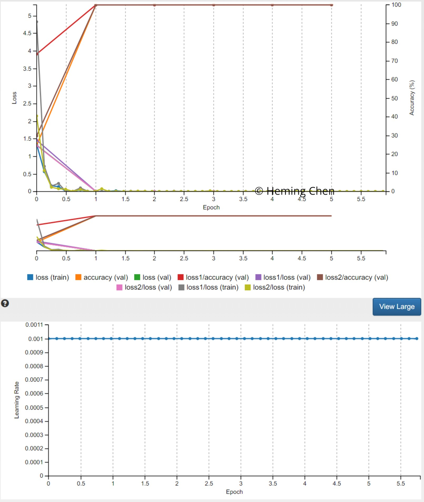
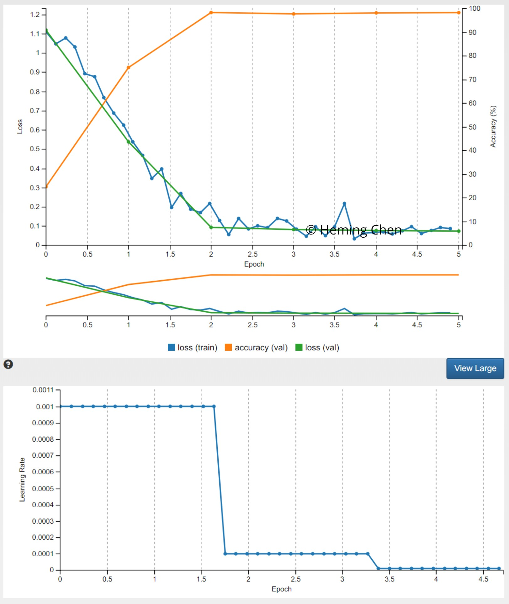
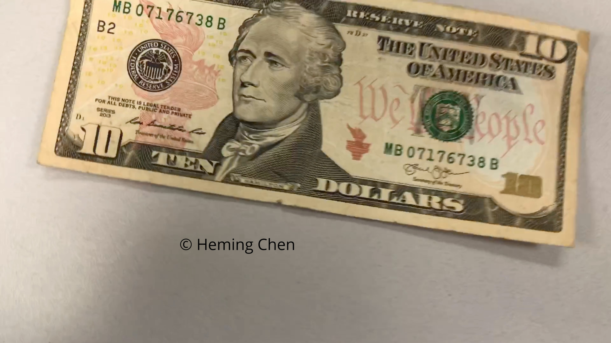
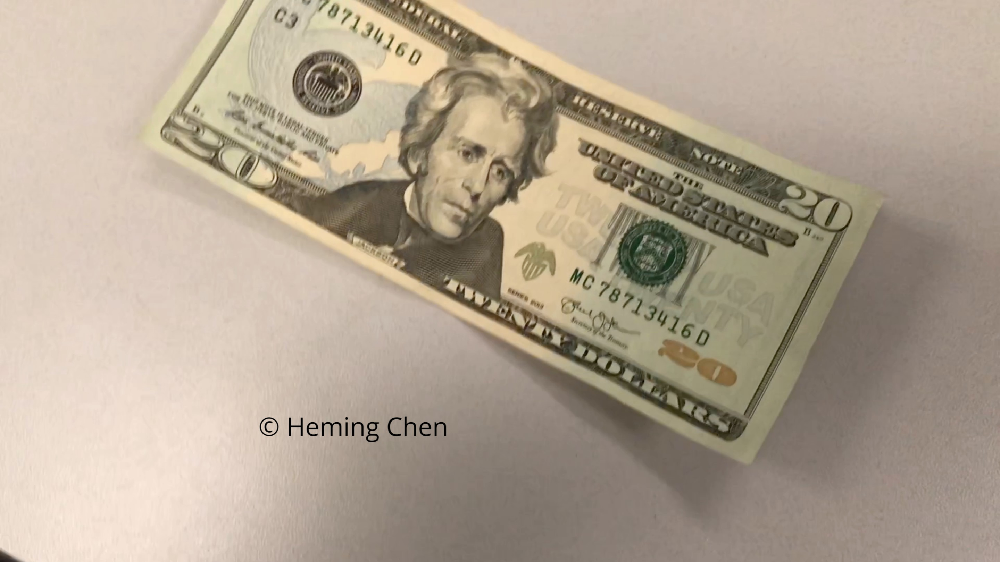
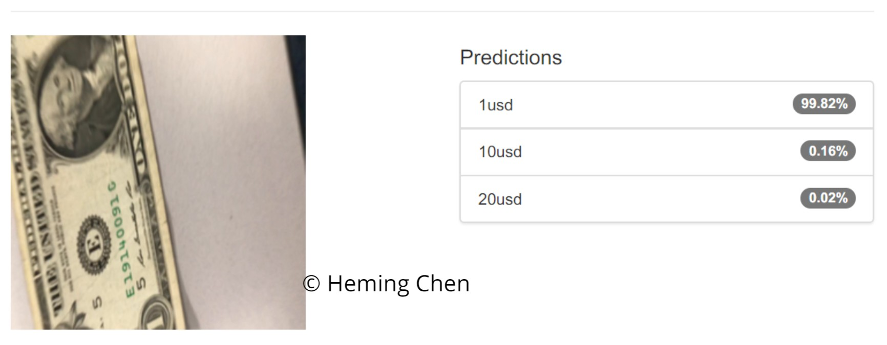

[](https://www.udacity.com/robotics)


# Robotic Inference Project

The goal of this project is to train deep neural networks for image classification. This project was completed on nVidia Digits platform with GPU support in Udacity workspace.

This project has two parts. Part 1 is to train a deep neural network to identify objects on conveyor belt, where data is provided by Udacity. In Part 2, students are required to find out another object identification task, collect training data and train another deep neural network to accomplish such task. This object identification task should have at least 3 classes.


## Part I: Udacity Task
The training data was provided by Udacity pre-uploaded to nVidia Digits platform. Both AlexNet and GoogLeNet models are trained on nVidia Digits platform with GPU enabled.

### GoogLeNet Model Results
The GoogLeNet model was trained with `5` epochs and a initial learning rate of `0.001`. 

As shown in the results below, it runs fast enough - somewhere around `7ms~8ms`, and has good performance - about `75.41%` accuracy.




Trained model can be found at `models/20180914-182959-afd7_epoch_6.0_conveyor_obj_id_googlenet_1.tar.gz`.


### AlexNet model Results
An AlexNet model was also trained with `6` epochs and an initial learning rate `0.001`. It runs fast enough - under `5ms`, and is also able to achieve a good performance - about `75.41%` accuracy.




However, the model is over `200MB` hence wasn't able to be uploaded to GitHub due to the `100MB` capacity limit.


## Part II: US Dollar Bill Identification


### Abstract
This part is about the student custom task, where I trained a model to identify US dollar bill value by reading an image taken at the front of the bill. 3 categories are selected, 1 USD bill, 10 USD bill and 20 USD bill.

### Introduction
Using machine learning to identify bank notes has less restrictions than traditional optical sensor based methods. For example, it does not require the bill to be completely flat, and also allows the bills to be presented in orientations. Hardware requirement can also be simplified, where only a USB camera is used as opposed to some custom made optical sensor. Updating the system is also easier. Since it is machine learning based, we only need to update the model to take into account new bills.

### Background / Formulation
In Udacity assignment, both AlexNet and GoogLeNet were used to identify objects on conveyor belt. Among the two models, GoogLeNet performed better - it was more accurate (> `75%`) and runs fast enough (< `10ms`). Input image needs to be `256x256x3` in dimension.

Based on these facts, I will be using GoogLeNet again on self-captured US dollar bill images converted to same dimension - `256x256x3`. Again, stochastic optimizer will be used with initial leaning rate of `0.01`.

### Data Acquisition
The training images were extracted from videos recorded an iPhone 7 Plus, with adequate lighting to the bills. In each video, a US dollar bill's front side is recorded with the camera randomly shifted and and rotated about the bill to generate more diversified training samples.

`ffmpeg` together with 'ImageJ' were used to extract images from `MOV` files generated on iPhone. For example, the following command would extract each frame of the 1 USD bill video `1usd_video.mov` as a `png` image with a name starting with `1usd_` and followed by a 5 digit sequence number, e.g. `1usd_00001.png`:
```bash
ffmpeg -i "1usd_video.mov" -f image2 "1usd_%05d.png"
```

After deleting some bad frame images, e.g. finger blocking the camera, etc., training data is collected. Some examples are below.






To meet requirement of GoogLeNet model, all images were then converted to `256x256x3`using `ImageMagick`. For example, the following bash command converts all images in current folder to `256x256` resolution with no padding. The aspect ratio of all images was changed from `4:3` to `1:1`.
```bash
# Resize and ignore aspect ratio - image will be distorted
for file in *.png; do convert $file -resize 256x256\! "`basename $file .png`_resized.png"; done
```

Examples are given below.

Original image:


Reszied image:


In the end, the resized images for each dollar bill are stored in separate folders per DIGITS requirement.


To make them available for training, all images were uploaded to `/home/workspace/data` folder on DIGITS. A new data set was then created, summarys are given below.


where a total of 1850 training images and 617 validation images were retrieved for 3 classes - 1 USD, 10 USD and 20 USD bills. Breakdowns are below.

| # of images | 1 USD | 10 USD | 20 USD |
|:-----------:|:----:|:-----:|:-----:|
| Training    | 789  | 603   | 458   |
| Validation  | 263  | 201   | 153   |

Training set summary


Validation set summary


### Results

As mentioned before, GoogLeNet model was trained with stochastic optimizer and initial learning rate of `0.01`. Results can be found below. Training took about some 15 minutes.

Trained model can be found at `models/20180914-125827-f846_epoch_30.0_usd_classification_googlenet_1.tar.gz`

Training loss


Learning rate


As in the fgiures, the learning rate started from 0.01, then reduced to 0.001 and eventually down to 0.0001. Some results are shown below.

1 USD bill identification



10 USD bill identification


20 USD bill identification


### Discussion
GoogLeNet in general has better accuracy than AlexNet in both assignments. It however requires more computing power and longer time to train. While running in real-time environment, it takes a bit longer time run the model to classify an image than AlexNet, due to the more complex network structure. But that time should be improved using Jetson TX2.

Stochastic optimizer is the go-to optimizer I use, and it appears good enough in handling large data set and being able to sufficiently optimize the model with fewer epochs.


### Conclusion / Future work
The trained GoogLeNet worked fairly well in classifying US dollar bills. With more enhancements, it can potentially replace the existing machines in many scenarios. However, for banks or other organizations that requires banknote authentication, more work needs to be done. For example, a high resolution image may be required to identify counterfeit bills. Also, some special lighting may also be needed to reflect water marks or other special security features on the bill. These factors will result in bigger models and longer inference time while running in real-time environment.
